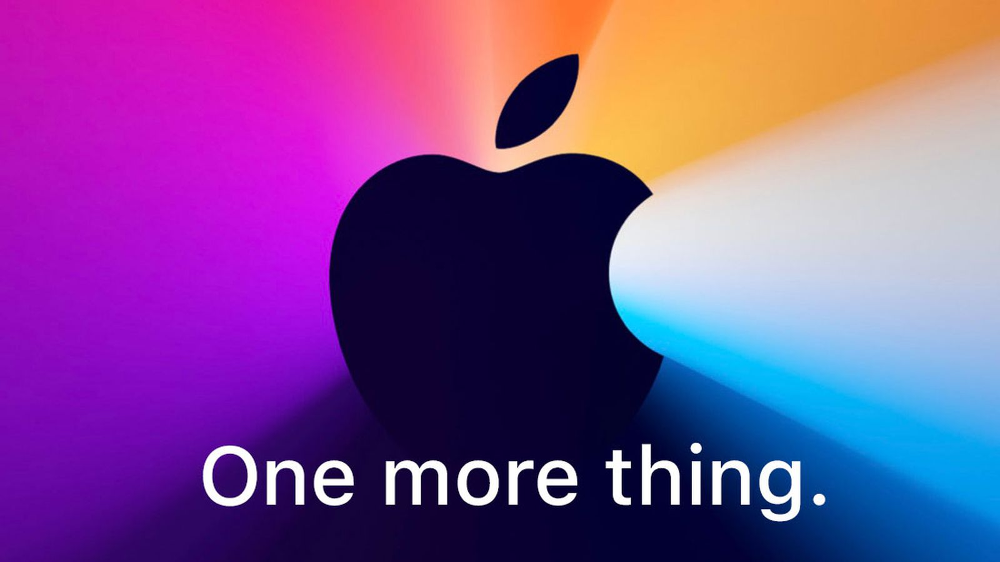
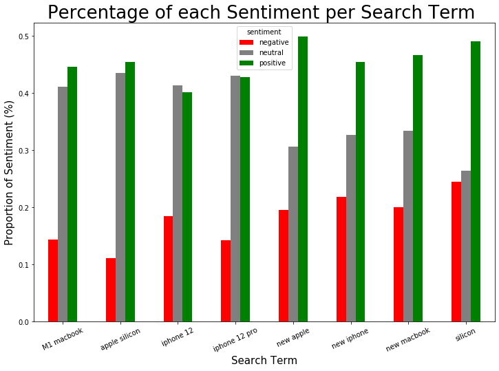
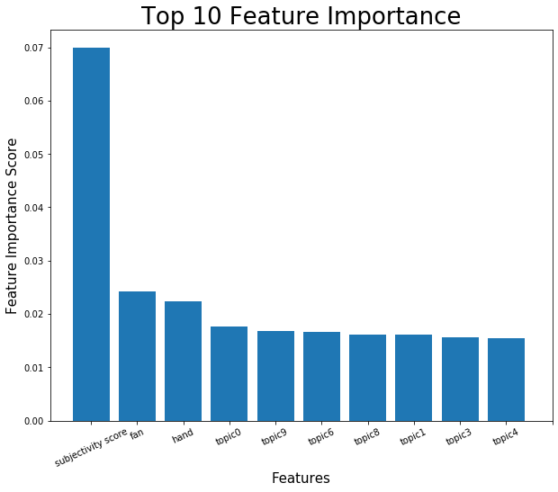

# Apple Product Launch Analysis (September - November, 2020)




**Authors:** [Dorjey Sherpa](https://www.linkedin.com/in/dorjey-sherpa-45501814a/), [Brendan Ferris](https://www.linkedin.com/in/brendangferris/)

## Overview

Over the past three months, Apple has had three major product launches:

| Event Name      | Products Announced                                                       | Date/Link         |
|-----------------|--------------------------------------------------------------------------|-------------------|
| Time Flies.     | Apple Watch, Apple Fitness+, Apple One, IPad                             | [September 15,2020](https://www.youtube.com/watch?v=b13xnFp_LJs&t=2353s) |
| Hi, Speed.      | HomePod Mini, IPhone 12, IPhone 12 Pro                                   | [October 13,2020](https://www.youtube.com/watch?v=KR0g-1hnQPA)   |
| One More Thing. | M1 Chip/Apple Silicon, macOS Big Sur, Macbook Air, Mac Mini, MacBook Pro | [November 10,2020](https://www.youtube.com/watch?v=5AwdkGKmZ0I)  |   

Our task was to analyze the sentiment of tweets surrounding these events, and report our findings.  

  

## Business Problem

After every major event, thousands of people turn to social media to talk about what they have witnessed. 2020 has been a major year for apple with three different launches for their best selling items. They redesigned the iPhone, made a significant change in the internal components for their laptops and iPads and updated the software. In light of these crucial changes, Apple has tasked us with classifying and analyzing twitter data over the past three product launch events. We have two main tasks. First, we must train a classification algorithm to tag tweet sentiment as either positive/negative/neutral. Then, we will analyze all of the twitter data (from September 1, 2020 to December 1, 2020) regarding the product launches and see what information can be gleaned.

## Data

Using [twint](https://github.com/twintproject/twint), we were able to gather all tweets over the three month period between September and December which included the following terms/phrases: *IPhone 12, Apple Silicon, M1 MacBook, New MacBook, IPhone 12 Pro, New Apple, New IPhone, Silicon.* After removing non-english Tweets and duplicate posts, we obtained a total of [985,657 observations and 14 features](https://drive.google.com/file/d/1Eg5JYtw_DtpUsX3sn_KQpSXVYQ8JyErt/view?usp=sharing). After data cleaning and feature engineering, we were left with 981,535 tweets with 24 main features. 

This wordcloud illustrates the frequent terms among the tweets we gathered:

 

## Methods
```
Necessary Packages and Libraries:

# To read and manipulate data
	Pandas
	Numpy
	Datetime
	Time
# To scrape Twitter using twint
	Subprocess
# For Natural Language Processing
	NLTK
	Wordcloud
	Gensim
	Textblob
	TfidfVectorizer
# For Modeling
	Sklearn 
# For Visualizations
	Matplotlib
	Seaborn 
```
Twitter was scraped using [twint](https://github.com/twintproject/twint). The code snippet can be found[here](https://github.com/brenfrrs/twitter_sentiment_analysis/blob/master/twitter_scraper.ipynb). 
After removing all hashtags and noise, VaderSentiment was used to tag all clean tweets. This function can be found [here](https://github.com/brenfrrs/twitter_sentiment_analysis/blob/master/scripts/scripts.py). We then proceeded into preprocessing by using tokenizing and lemmatizing. Lemmatization was used to preserve the context of the word.

During modeling, we reduced the size of the dataframe by randomly selecting 30,000 tweets from each tagged "sentiment" to generate a list of the important features. This was done to reduce training time.

## Results
Through our analysis, we discovered there were more positve tweets than negative and neutral tweets. Figure below illustrates the change in people's tweet sentiment before and after the Apple events.
 


We hypothesized that most of the tweets would probably be about the new iPhone due to the redesign and camera specification upgrades. Supporting our hypothesis, the figure be demonstrates that 55 percent of the tweets we gathered were regarding the new iPhone.
 


When we look at the sentiment analysis by search term, we find that the new iPhone has neutral and positive sentements. Overall, this figure demonstrates that people recevied the Apple events with more positive and neutral sentiment than negative.
 


As illustrated in the figure below, we were able to generate topic and topic scores using Textblob. We then analyzed the overall sentiment per topic. Based on the topic sentiment, we note that in general, tweets regarding Apple are mostly postive and neutral as discovered by the timeseries analysis above. The negative sentiment per topic remains below 20%.
 


However, upon closer inspection, we see that topic 5 has the highest negative sentiment. We discovered topic 5 to be about the new iPhone packaging system (new iPhone will not contain a charging block or headphones in the box). 

```
Topic: 5 	
Word: 0.020 "charger" + 0.009  "charging" + 0.009 "usb" + 0.009 "headphone" + 0.008 "come" + 0.008 "box" + 0.007 "cable" + 0.006 "samsung" + 0.006 "camera" + 0.006 "prosser"
```

## Conclusions

The feature importance extracted from the RandomForestClassifier model using GridSearchCV state that the following were the top 10 features (greatest importance from left to right). 
```
'subjectivity score', 'fan', 'hand', 'marry', 'topic9', 'topic6', 'topic0', 'topic1', 'topic8', 'topic4'
```


The topics can be found in this [notebook.](https://github.com/brenfrrs/twitter_sentiment_analysis/blob/master/eda_notebook.ipynb)

## Next Steps

There are instances where people use negative language in a positive way when describing apple products. For example, the phrase *'Apple M1 kills intel chips speed'* may be classified by our model as negative, when in fact it is positive. We developed a [small script](./scripts/tagger.py) that can be used to quickly tag tweets as positive/negative/neutral.

Additional insights may also be gained from broadening the search terms used in analysis, as well as the time window. 

## For More Information

See the full modeling/analysis notebooks [here](path/to/notebooks) or review our [presentation](path/to).

For additional information, contact [Dorjey Sherpa](mailto:dorjeys3@gmail.com) or [Brendan Ferris](mailto:brendanfrrs@gmail.com).

## Repository Structure

<pre>
Place file tree here.
</pre>